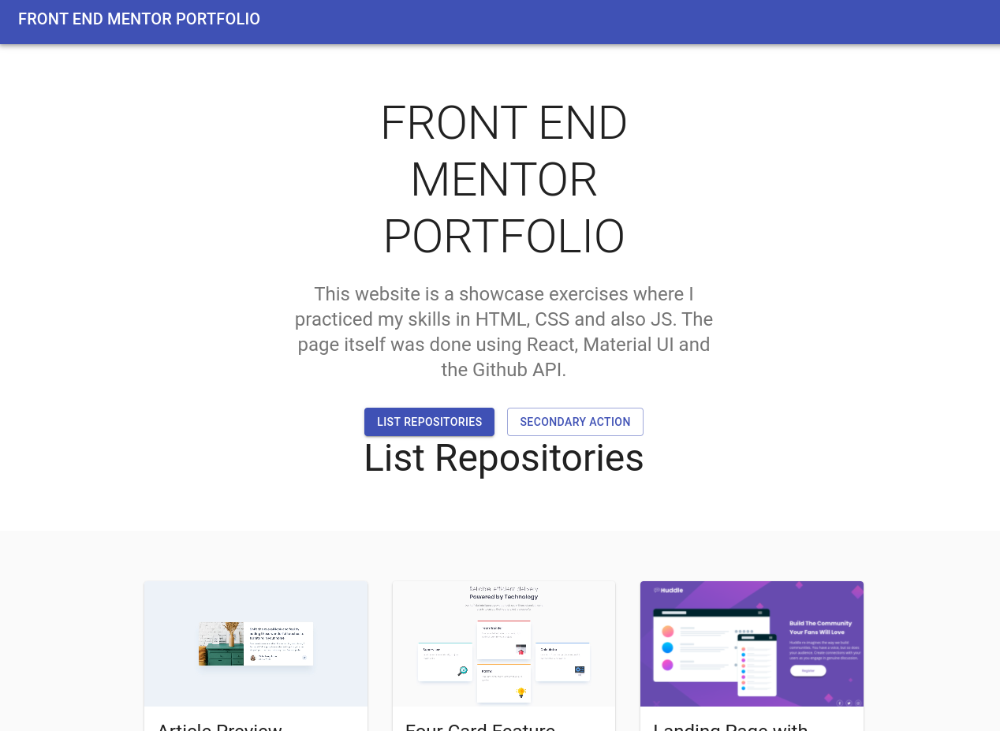

## Front End Mentor Portfolio

This website is a showcase exercises where I practiced my skills in HTML, CSS and also JS. The page itself was done using React, Material UI and the Github API.

You can see it live .

## Front End Mentor

Frontend Mentor provides designs so that you can practice your front-end skills using a real-life workflow. Our challenges include designs (both mobile and desktop), assets, and a style guide to get you started. The rest is up to you!
